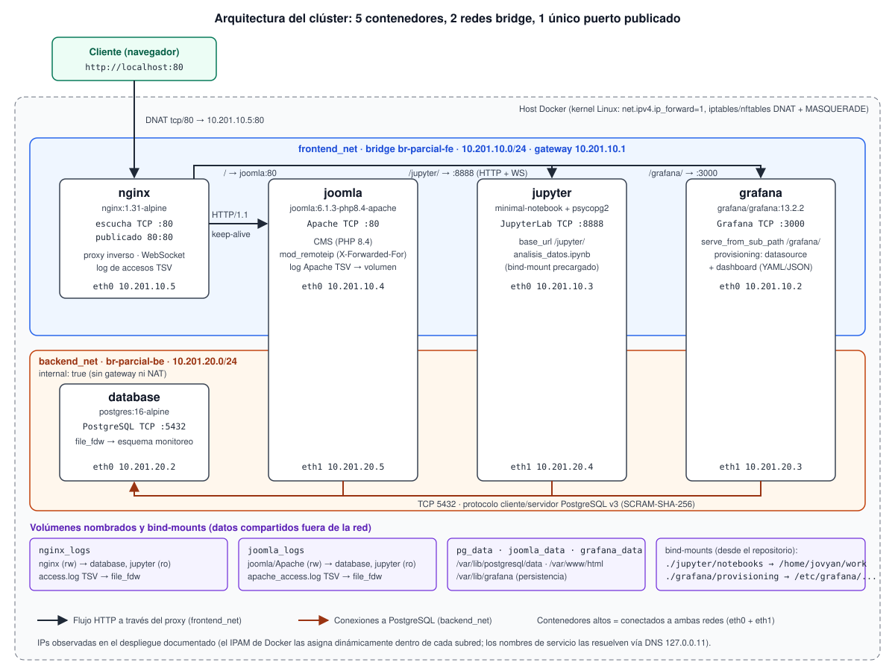
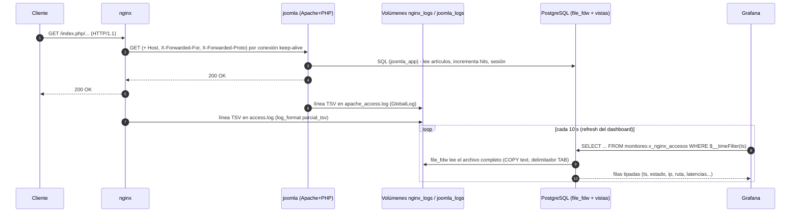
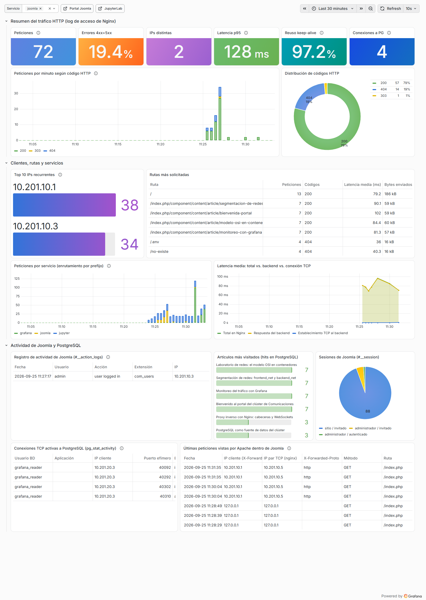
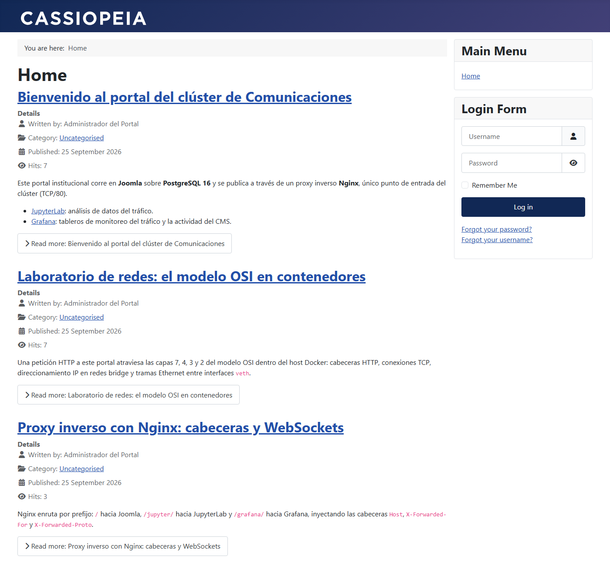
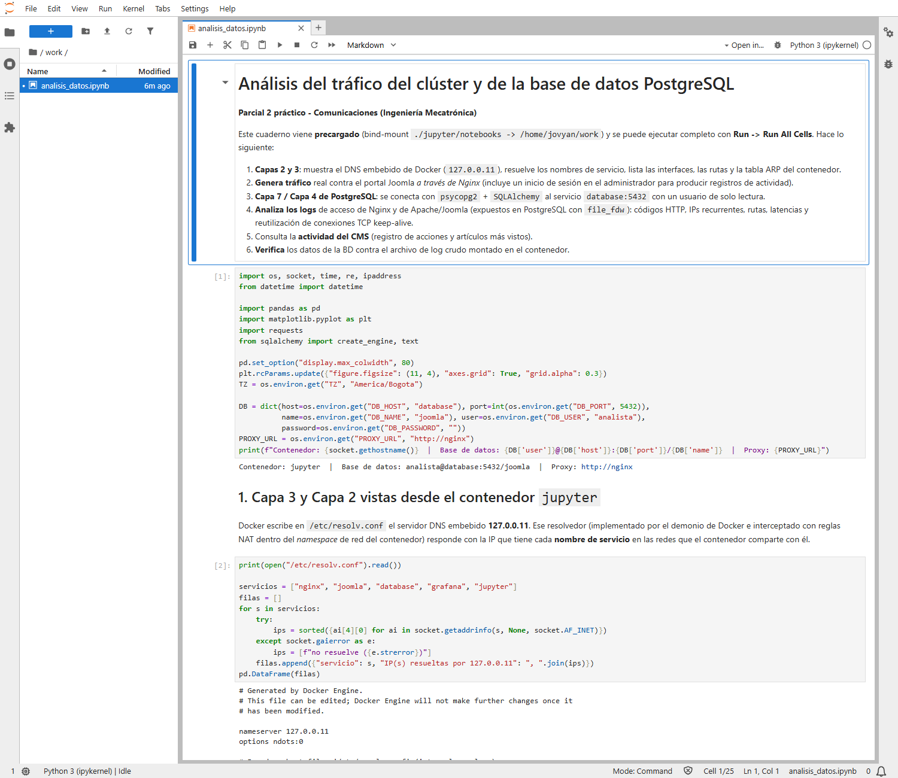
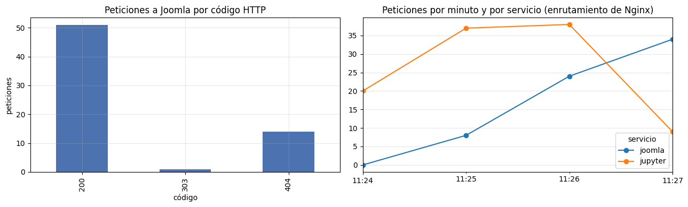
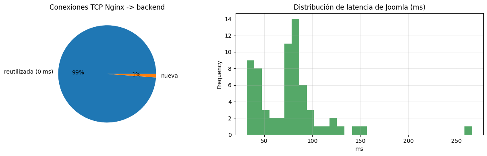

# INFORME TÉCNICO: despliegue multi-contenedor, orquestación, arquitectura y análisis del modelo OSI

**Parcial 2 práctico · Comunicaciones · Ingeniería Mecatrónica**
**Docente:** Ing. Andrés Julián Moreno M.Sc.

> Todas las direcciones IP, MAC, puertos, capturas y tiempos de este informe son **datos reales** del despliegue documentado (Docker Desktop 29.7 sobre Windows 11, motor Linux).
> Los archivos crudos están en [`docs/evidencias/`](docs/evidencias/) y se pueden regenerar con `docs/recolectar_evidencias.ps1`.
> Las IPs de cada contenedor las asigna dinámicamente el IPAM de Docker **dentro** de subredes fijas, así que pueden variar entre despliegues; las subredes, los gateways y los nombres de servicio no cambian.

---

## Contenido

- [0. Resumen de la solución y decisiones de diseño](#0-resumen-de-la-solución-y-decisiones-de-diseño)
- [Sección 1: Topología y flujo de información](#sección-1-topología-y-flujo-de-información)
- [Sección 2: Análisis detallado del modelo OSI en la solución](#sección-2-análisis-detallado-del-modelo-osi-en-la-solución)
  - [2.1 Capa 7 - Aplicación](#21-capa-7--aplicación)
  - [2.2 Capa 4 - Transporte](#22-capa-4--transporte)
  - [2.3 Capa 3 - Red](#23-capa-3--red)
  - [2.4 Capa 2 - Enlace de datos](#24-capa-2--enlace-de-datos)
  - [2.5 Recorrido completo de una petición por las cuatro capas](#25-recorrido-completo-de-una-petición-por-las-cuatro-capas)
- [Sección 3: Guía de verificación y demostración](#sección-3-guía-de-verificación-y-demostración)
- [Anexo A: Correspondencia con la rúbrica](#anexo-a-correspondencia-con-la-rúbrica)
- [Anexo B: Limitaciones y mejoras posibles](#anexo-b-limitaciones-y-mejoras-posibles)

---

## 0. Resumen de la solución y decisiones de diseño

El clúster se levanta con `docker compose up -d` y no requiere pasos manuales. Así se resolvió cada punto crítico del enunciado:

| Problema / punto crítico | Solución adoptada |
|---|---|
| Joomla arranca con el **asistente web de instalación**, lo que sería un paso manual. | Se usa la **instalación desatendida** de la imagen oficial (`JOOMLA_SITE_NAME`, `JOOMLA_ADMIN_*`, `JOOMLA_DB_TYPE=pgsql`). Un envoltorio del entrypoint ([`joomla/joomla-start.sh`](joomla/joomla-start.sh)) instala, siembra 6 artículos (idempotente) y arranca Apache. |
| Joomla debe esperar a PostgreSQL. | `depends_on: database: condition: service_healthy` con `pg_isready -U $$POSTGRES_USER`. Nginx espera a que joomla, jupyter y grafana estén *healthy*. |
| **Grafana no puede leer archivos de log directamente** (no trae un datasource de archivos) y no hay cupo para Loki/Promtail (el enunciado pide 5 contenedores). | Los logs se exponen **dentro de PostgreSQL** con la extensión `file_fdw` (tablas foráneas sobre archivos) y vistas tipadas. Grafana usa un **datasource PostgreSQL aprovisionado**. Así se cumplen a la vez "logs de Joomla" y "métricas desde PostgreSQL" (ver §1.4). |
| En las imágenes oficiales, `/var/log/apache2/access.log` y `/var/log/nginx/access.log` son **enlaces a `/dev/stdout`**: compartir esos directorios deja carpetas sin archivos. | Se añade un **segundo log en formato TSV** escrito en volúmenes dedicados (`GlobalLog` en Apache y `access_log` adicional en Nginx), sin perder `docker logs`. |
| Jupyter y Grafana bajo subrutas (`/jupyter`, `/grafana`) cargan a medias si no saben que viven ahí. | Jupyter: `ServerApp.base_url=/jupyter/`. Grafana: `GF_SERVER_ROOT_URL` + `GF_SERVER_SERVE_FROM_SUB_PATH=true`. Nginx no reescribe la ruta. |
| "Kernel connection error" en Jupyter. | Nginx reenvía `Upgrade: $http_upgrade` y `Connection: $connection_upgrade` (mapa), con `proxy_http_version 1.1` y timeouts largos. Verificado con un handshake `101 Switching Protocols`. |
| El token aleatorio de Jupyter. | Token fijo desde `.env` (`JUPYTER_TOKEN=parcial2026`); `default_url` abre directamente `analisis_datos.ipynb`. |
| Las imágenes `jupyter/*` de Docker Hub están congeladas desde 2023 y no incluyen `psycopg2`. | Imagen propia construida por compose desde `quay.io/jupyter/minimal-notebook:lab-4.6.3` (la misma familia `minimal-notebook`, etiqueta fijada) con psycopg2, SQLAlchemy, pandas y matplotlib. |
| **Contradicción del enunciado**: el cuaderno debe consultar PostgreSQL con psycopg2, pero la tabla de redes no pone Jupyter en `backend_net`. | Jupyter se conecta **también a `backend_net`** (justificado por el propio requisito del cuaderno) y usa el rol `analista`, de **solo lectura**, que solo ve el esquema `monitoreo`. La BD sigue aislada del exterior. |
| Que la BD "no tenga visibilidad hacia la red externa". | `backend_net` se declara con `internal: true`: sin gateway, sin NAT y con reglas `DROP` en el host (verificado en §2.3). El 5432 no se publica. |
| Choques con redes o contenedores existentes en la máquina del evaluador. | No se usa `container_name` ni nombres globales de red. Las subredes `10.201.10.0/24` y `10.201.20.0/24` quedan fuera de los pools automáticos de Docker y son configurables en `.env`. |
| Clonado en Windows (`core.autocrlf`) rompería los `.sh` con `\r`. | `.gitattributes` fuerza `eol=lf`. |
| Seguridad: credenciales y privilegios. | Roles separados: `dba_admin` (superusuario), `joomla_app` (dueño de la BD del CMS), `grafana_reader` y `analista` (solo lectura). Las tablas del CMS (p. ej. `#__users` con hashes) **no** son legibles por los lectores: la actividad se expone mediante funciones `SECURITY DEFINER` que devuelven solo las columnas necesarias. |

---

## Sección 1: Topología y flujo de información

### 1.1 Diagrama de arquitectura



### 1.2 Contenedores, redes y puertos

| Servicio | Imagen | Redes (IP observada) | Puerto TCP en el contenedor | Publicado en el host |
|---|---|---|---|---|
| `nginx` | `nginx:1.31-alpine` | frontend_net (10.201.10.5) | 80 | **80:80** (único) |
| `joomla` | `joomla:6.1.3-php8.4-apache` | frontend_net (10.201.10.4), backend_net (10.201.20.5) | 80 (Apache) | No |
| `database` | `postgres:16-alpine` | backend_net (10.201.20.2) | 5432 | No |
| `jupyter` | `parcial-comunicaciones/jupyter:1.0` (build) | frontend_net (10.201.10.3), backend_net (10.201.20.4) | 8888 | No |
| `grafana` | `grafana/grafana:13.2.2` | frontend_net (10.201.10.2), backend_net (10.201.20.3) | 3000 | No |

| Red | Driver | Bridge Linux | Subred | Gateway | `internal` | Miembros |
|---|---|---|---|---|---|---|
| `frontend_net` | bridge | `br-parcial-fe` | 10.201.10.0/24 | 10.201.10.1 | `false` | nginx, joomla, jupyter, grafana |
| `backend_net` | bridge | `br-parcial-be` | 10.201.20.0/24 | 10.201.20.1 | **`true`** | database, joomla, grafana, jupyter |

Fuente: [`docs/evidencias/02_redes_ip_mac.txt`](docs/evidencias/02_redes_ip_mac.txt).

| Volumen | Tipo | Montado en | Propósito |
|---|---|---|---|
| `pg_data` | nombrado | database:`/var/lib/postgresql/data` | Persistencia de PostgreSQL |
| `joomla_data` | nombrado | joomla:`/var/www/html` | Código y assets del CMS |
| `grafana_data` | nombrado | grafana:`/var/lib/grafana` | Estado interno de Grafana (la configuración es declarativa) |
| `nginx_logs` | nombrado, compartido | nginx (rw), database y jupyter (ro) | Log de accesos TSV de Nginx |
| `joomla_logs` | nombrado, compartido | joomla (rw), database y jupyter (ro) | Log de accesos TSV de Apache/Joomla |
| `./jupyter/notebooks` | bind-mount | jupyter:`/home/jovyan/work` | Cuaderno precargado |
| `./grafana/provisioning` | bind-mount (ro) | grafana:`/etc/grafana/provisioning` | Datasource + dashboard declarativos |
| `./database/init` | bind-mount (ro) | database:`/docker-entrypoint-initdb.d` | Roles y esquema `monitoreo` |

### 1.3 Flujos de datos

1. **Cliente → Nginx:** el navegador abre TCP a `host:80`. El kernel del host aplica **DNAT** hacia `10.201.10.5:80` (nginx).
2. **Nginx → backends (frontend_net):** según el prefijo de la URL:
   - `/` → `joomla:80`
   - `/jupyter/` → `jupyter:8888` (HTTP + WebSocket del kernel)
   - `/grafana/` → `grafana:3000`

   Los nombres se resuelven con el DNS embebido `127.0.0.11`. Nginx mantiene un **pool de conexiones TCP keep-alive** hacia cada backend.
3. **Joomla → PostgreSQL (backend_net):** cada petición PHP abre una conexión TCP a `database:5432` con el rol `joomla_app`.
4. **Grafana / Jupyter → PostgreSQL (backend_net):** consultas SQL de solo lectura al esquema `monitoreo` (roles `grafana_reader` y `analista`).
5. **Logs (fuera de la red, por volúmenes):** Nginx y Apache escriben TSV en `nginx_logs` y `joomla_logs`; PostgreSQL los lee en cada consulta mediante `file_fdw`.

### 1.4 Mecanismo de recolección de logs y métricas: ¿cómo llegan los eventos a Grafana?



**Paso a paso:**

1. **Producción del evento.**
   - Nginx registra cada petición con el `log_format parcial_tsv` ([`nginx/default.conf`](nginx/default.conf)): 20 campos separados por TAB, entre ellos `$msec`, `$remote_addr`, `$status`, `$request_time`, `$upstream_addr`, `$upstream_connect_time`, `$connection`, `$connection_requests` y `$servicio`.
   - Apache, dentro de Joomla, registra con `GlobalLog` otro TSV ([`joomla/apache-logging.conf`](joomla/apache-logging.conf)) con la IP del cliente original (`%a`, reconstruida por `mod_remoteip`), la IP del par TCP (`%{c}a`), `X-Forwarded-Proto`, el código, la duración en µs (`%D`) y las reutilizaciones keep-alive (`%k`).
   - `escape=default` (Nginx) y el escape nativo de Apache convierten comillas, barras y bytes no imprimibles en `\xHH`, así que **un TAB nunca aparece dentro de un campo** y el formato no es ambiguo.
2. **Transporte.** Los logs no viajan por la red: se escriben en **volúmenes nombrados** que PostgreSQL monta en solo lectura en `/var/log/fuentes/...`.
3. **Exposición como tablas.** El script [`database/init/02-monitoreo.sql`](database/init/02-monitoreo.sql) crea:
   - la extensión `file_fdw`, un servidor `fuentes_log` y dos **tablas foráneas** (`ft_nginx_access`, `ft_joomla_apache`) con `format 'text'`, `delimiter E'\t'` y `encoding 'LATIN1'`. LATIN1 hace que cualquier byte sea válido, así que una línea maliciosa no rompe la lectura del archivo completo;
   - funciones `leer_nginx()` / `leer_joomla_apache()` (`SECURITY DEFINER`) que devuelven vacío con un `WARNING` si el archivo aún no existe o hay una línea corrupta, para que los paneles no queden en error durante el arranque;
   - **vistas tipadas** `monitoreo.v_nginx_accesos` y `monitoreo.v_joomla_apache`, que convierten `msec` a `timestamptz`, los códigos a entero, los `-` a `NULL` y calculan `clase_estado` (`2xx`, `4xx`...);
   - vistas de **actividad del CMS**: `v_actividad_joomla` (tabla `#__action_logs`: inicios de sesión, ediciones...), `v_articulos_joomla` (columna `hits`, que Joomla incrementa en cada visita), `v_sesiones_joomla` (`#__session`) y `v_conexiones_pg` (`pg_stat_activity`). Como las tablas de Joomla aún no existen cuando corre el script, se consultan con SQL dinámico (`EXECUTE format(...)`) y se ignora `undefined_table`.
4. **Consumo.** Grafana tiene aprovisionado ([`grafana/provisioning/datasources/datasource.yml`](grafana/provisioning/datasources/datasource.yml)) el datasource `PostgreSQL-Parcial` (uid `pg-parcial`, `database:5432`, usuario `grafana_reader`) y ([`dashboards/dashboard.yml`](grafana/provisioning/dashboards/dashboard.yml)) el dashboard [`joomla_logs.json`](grafana/provisioning/dashboards/joomla_logs.json), que además es el **home** (`GF_DASHBOARDS_DEFAULT_HOME_DASHBOARD_PATH`). El acceso anónimo en modo *Viewer* permite ver las gráficas sin iniciar sesión.
5. **Latencia del pipeline.** No hay agente ni cola: cada refresco del dashboard (10 s) relee los archivos. Un evento aparece en Grafana en el siguiente refresco.

**El dashboard (17 paneles)** ([captura](docs/img/02_grafana_dashboard.png)):

- 6 indicadores: peticiones, % errores 4xx+5xx, IPs distintas, latencia p95, % reutilización keep-alive y conexiones a PostgreSQL.
- Peticiones por minuto según código HTTP.
- Distribución de códigos HTTP.
- Top 10 IPs recurrentes.
- Rutas más solicitadas.
- Peticiones por servicio (enrutamiento por prefijo).
- Latencia total vs. backend vs. establecimiento TCP.
- Registro de actividad de Joomla.
- Artículos más visitados.
- Sesiones de Joomla.
- Conexiones TCP activas a PostgreSQL.
- Últimas peticiones vistas por Apache.

La variable `$servicio` filtra por `joomla`, `jupyter` o `grafana` (por defecto `joomla`).



---

## Sección 2: Análisis detallado del modelo OSI en la solución

### 2.1 Capa 7 - Aplicación

#### a) Cabeceras HTTP que inyecta Nginx

Configuración ([`nginx/default.conf`](nginx/default.conf)):

```nginx
proxy_http_version 1.1;
proxy_set_header Host              $http_host;
proxy_set_header X-Real-IP         $remote_addr;
proxy_set_header X-Forwarded-For   $proxy_add_x_forwarded_for;
proxy_set_header X-Forwarded-Proto $scheme;
proxy_set_header X-Forwarded-Host  $http_host;
proxy_set_header Upgrade           $http_upgrade;
proxy_set_header Connection        $connection_upgrade;
```

| Cabecera | Problema que resuelve | Efecto observado en la solución |
|---|---|---|
| `Host` | Sin ella, Nginx enviaría `Host: joomla_up` (el nombre del upstream). Joomla construye URLs absolutas y Grafana/Jupyter validan el origen a partir de `Host`. | Joomla genera enlaces `http://localhost/...` correctos. Se usa `$http_host` (incluye el puerto) para que funcione aunque se cambie `HTTP_PORT`. Grafana y Jupyter aceptan las peticiones POST/WebSocket porque `Origin` coincide con `Host`. |
| `X-Forwarded-For` | Tras el proxy, el backend solo ve la IP de Nginx como origen TCP. `$proxy_add_x_forwarded_for` añade `$remote_addr` a la lista existente (cadena de proxies). | En Apache, `mod_remoteip` (con `RemoteIPHeader X-Forwarded-For` y proxies internos de confianza) sustituye la IP del cliente. El log de Apache muestra **`ip_cliente=10.201.10.1` pero `ip_par_tcp=10.201.10.5` (nginx)** ([evidencia 10](docs/evidencias/10_logs_muestra.txt)). El *Action Log* de Joomla guarda esa IP reconstruida: el login hecho desde el cuaderno quedó registrado con `10.201.10.3`, la IP de Jupyter, no la de Nginx. |
| `X-Forwarded-Proto` | El backend no sabe si el cliente usó `http` o `https` (el tramo interno siempre es `http`). Es necesario para generar redirecciones y cookies `Secure` correctas. | Apache lo registra (`http`). Jupyter lo respeta gracias a `trust_xheaders=True`. |
| `X-Real-IP` / `X-Forwarded-Host` | Variantes de uso común (una sola IP, host original). | Disponibles para las aplicaciones. |
| `Connection: ""` | `Connection` es una cabecera *hop-by-hop*: por defecto Nginx envía `Connection: close` al backend. | Al enviarla vacía (mapa `'' → ''`), la conexión TCP hacia el backend **se puede reutilizar** (ver §2.2). |

#### b) Mecanismo HTTP Upgrade para los WebSockets del kernel de Jupyter

JupyterLab usa un **WebSocket** (`/jupyter/api/kernels/<id>/channels`) para enviar código al kernel y recibir las salidas en tiempo real. El protocolo WebSocket (RFC 6455) arranca como una petición HTTP/1.1 que pide **cambiar de protocolo sobre la misma conexión TCP**:

```
GET /jupyter/api/events/subscribe?token=... HTTP/1.1
Connection: Upgrade
Upgrade: websocket
Sec-WebSocket-Version: 13
Sec-WebSocket-Key: dGhlIHNhbXBsZSBub25jZQ==
```

Respuesta real obtenida **a través de Nginx** ([evidencia 08](docs/evidencias/08_http_cabeceras_websocket.txt)):

```
HTTP/1.1 101 Switching Protocols
Server: nginx/1.31.6
Connection: upgrade
Upgrade: websocket
Sec-Websocket-Accept: s3pPLMBiTxaQ9kYGzzhZRbK+xOo=
```

- `Sec-WebSocket-Accept = base64( SHA-1( Sec-WebSocket-Key + "258EAFA5-E914-47DA-95CA-C5AB0DC85B11" ) )`. El valor coincide con el ejemplo del RFC 6455, lo que demuestra que el servidor Jupyter recibió la clave íntegra.
- Después del `101`, la conexión TCP deja de transportar HTTP y pasa a transportar **tramas WebSocket** bidireccionales. Nginx actúa como túnel.
- `Upgrade` y `Connection` son *hop-by-hop*: un proxy **no** las reenvía salvo que se configure de forma explícita. Por eso se usan `proxy_set_header Upgrade $http_upgrade` y `Connection $connection_upgrade` (mapa: si el cliente envía `Upgrade`, se reenvía `upgrade`). Sin esto, JupyterLab muestra *"Kernel connection error"*.
- `proxy_http_version 1.1` es obligatorio (Upgrade no existe en HTTP/1.0). `proxy_read_timeout 3600s` evita que Nginx corte kernels inactivos a los 60 s por defecto. `proxy_buffering off` entrega los mensajes sin retardo.
- El log de Nginx registra estas peticiones con **código 101** y la duración total de la sesión WebSocket. Grafana Live (`/grafana/api/live/ws`) usa el mismo mecanismo.
- Verificación funcional: desde el navegador, a través de Nginx, se ejecutaron las 14 celdas de código del cuaderno ("Run All Cells") con el kernel en estado *Idle/Busy* y sin errores.

#### c) Protocolo de aplicación cliente/servidor de PostgreSQL

PostgreSQL usa su propio protocolo binario (*Frontend/Backend Protocol v3*) sobre TCP/5432. Cada mensaje lleva un byte de tipo, una longitud de 4 bytes y la carga útil. Una conexión de `psycopg2`, Grafana o Joomla recorre estas fases:

| Fase | Mensajes (F = cliente, B = servidor) |
|---|---|
| Inicio | F `StartupMessage` (versión 3.0, `user`, `database`, `application_name`). |
| Autenticación | B `AuthenticationSASL` → F `SASLInitialResponse` → B `SASLContinue` → F `SASLResponse` → B `AuthenticationOk`. **SCRAM-SHA-256** es el método por defecto de la imagen `postgres:16` (`pg_hba.conf: host all all all scram-sha-256`): la contraseña nunca viaja en claro. |
| Parámetros | B `ParameterStatus` (server_version, TimeZone, client_encoding...), B `BackendKeyData` (PID + clave para cancelar), B `ReadyForQuery`. |
| Consulta simple | F `Query` ('Q') → B `RowDescription` ('T') → B `DataRow` ('D') × n → B `CommandComplete` ('C') → B `ReadyForQuery` ('Z'). |
| Consulta extendida | F `Parse`/`Bind`/`Execute`/`Sync` (sentencias preparadas, usadas por los drivers PDO y psycopg2 con parámetros). |
| Cierre | F `Terminate` ('X') seguido del cierre TCP (FIN). |

Consulta real hecha desde el cuaderno de Jupyter:

| usuario | ip_servidor | puerto_servidor | ip_cliente | puerto_cliente_efimero | ssl |
|---|---|---|---|---|---|
| analista | 10.201.20.2 | 5432 | 10.201.20.4 | 51820 | off |

El tráfico va sin TLS (`sslmode=disable`) porque viaja solo por `backend_net`, un segmento interno sin salida. En un entorno productivo se habilitaría TLS (ver Anexo B). Por cada conexión, PostgreSQL crea **un proceso servidor (backend)**, visible en `pg_stat_activity` con su `pid`, IP y puerto de cliente.

#### d) Formato y estructura de los logs generados

**Log de acceso de Nginx** (`/var/log/nginx-parcial/access.log`, TSV, 20 campos):

| # | Campo | Ejemplo real |
|---|---|---|
| 1 | `$msec` (epoch con ms) | `1790353895.603` |
| 2 | `$time_iso8601` | `2026-09-25T11:31:35-05:00` |
| 3 | `$remote_addr` (IP del par TCP) | `10.201.10.1` |
| 4 | `$http_x_forwarded_for` | `-` |
| 5-7 | método, URI, protocolo | `GET`, `/`, `HTTP/1.1` |
| 8 | `$status` | `200` |
| 9 | `$body_bytes_sent` | `17847` |
| 10 | `$request_time` (s) | `0.075` |
| 11 | `$upstream_addr` | `10.201.10.4:80` |
| 12-14 | estado / tiempo de respuesta / **tiempo de conexión TCP** del upstream | `200`, `0.075`, `0.001` |
| 15-16 | `$connection` (id de conexión cliente), `$connection_requests` | `111`, `1` |
| 17 | `$servicio` (variable fijada por `location`) | `joomla` |
| 18-20 | Host, Referer, User-Agent | `localhost`, `-`, `curl/8.21.0` |

**Log de Apache dentro de Joomla** (`/var/log/joomla/apache_access.log`, TSV, 13 campos):

```
2026-09-25T11:31:35-0500  10.201.10.1  10.201.10.5  http  GET  /index.php  HTTP/1.1  200  17819  74163  0  -  curl/8.21.0
 fecha (%t ISO)            IP cliente   IP par TCP   XFP   mét. URI         proto     cód. bytes  µs(%D) %k ref  user-agent
```

Las sondas del *healthcheck* (curl a `127.0.0.1`) se excluyen con `SetEnvIf Remote_Addr ... env=!sonda_local`.

**Log de actividad de Joomla** (tabla `jos_action_logs` en PostgreSQL): `id`, `message_language_key` (p. ej. `PLG_ACTIONLOG_JOOMLA_USER_LOGGED_IN`), `message` (JSON con usuario, id, acción), `log_date` (UTC), `extension` (`com_users`, `com_content`...), `user_id`, `item_id` e `ip_address`. La siembra activa `ip_logging=1` en `com_actionlogs`. Registro real: `2026-09-25 11:27:17 · admin · user logged in · com_users · 10.201.10.3`.

---

### 2.2 Capa 4 - Transporte

#### a) Puertos TCP involucrados

| Puerto | Protocolo | Quién escucha | Visibilidad |
|---|---|---|---|
| **80** | TCP (HTTP/1.1) | nginx (`0.0.0.0:80`) | **Publicado** en el host (`0.0.0.0:80->80/tcp`) |
| 80 | TCP (HTTP/1.1) | joomla (Apache) | Solo frontend_net |
| **8888** | TCP (HTTP + WebSocket) | jupyter | Solo frontend_net |
| **3000** | TCP (HTTP + WebSocket) | grafana | Solo frontend_net |
| **5432** | TCP (protocolo PostgreSQL v3) | database | Solo backend_net |
| 53 | UDP/TCP (DNS) | `127.0.0.11` dentro de cada contenedor | Local al *namespace* de red |
| 32768-60999 | TCP | Puertos **efímeros** del lado cliente | p. ej. `10.201.20.6:56542 → 10.201.20.2:5432` |

`docker compose ps` confirma que solo Nginx tiene un puerto mapeado; los demás muestran el puerto expuesto sin publicar (`5432/tcp`, `3000/tcp`...) ([evidencia 01](docs/evidencias/01_estado_servicios.txt)). Dentro de `database`, `/proc/net/tcp` muestra el socket en `LISTEN` en `00000000:1538` (0x1538 = **5432**) y una conexión `ESTABLISHED` (estado `01`) `0214C90A:1538 ↔ 0314C90A:9C9C`, es decir `10.201.20.2:5432 ↔ 10.201.20.3:40092` (Grafana) ([evidencia 09](docs/evidencias/09_conexiones_postgresql.txt)).

#### b) Establecimiento de conexiones: el *three-way handshake* capturado

Captura con `tcpdump` sobre el puente `br-parcial-be` mientras un cliente nuevo se conecta a `database:5432` ([evidencia 07](docs/evidencias/07_captura_arp_tcp_backend.txt)):

```
16:31:17.787920 c2:fe:d8:13:82:bb > a6:29:d4:71:bf:74  10.201.20.6.56542 > 10.201.20.2.5432: Flags [S],  seq 3093668039, win 64240, options [mss 1460,sackOK,TS,nop,wscale 10]
16:31:17.787947 a6:29:d4:71:bf:74 > c2:fe:d8:13:82:bb  10.201.20.2.5432 > 10.201.20.6.56542: Flags [S.], seq 552233254, ack 3093668040, win 65160, options [mss 1460,...]
   ... (ACK, StartupMessage, SCRAM, Query, DataRow...)
16:31:17.805421 c2:fe:d8:13:82:bb > a6:29:d4:71:bf:74  10.201.20.6.56542 > 10.201.20.2.5432: Flags [F.], seq 383, ack 723
16:31:17.808032 a6:29:d4:71:bf:74 > c2:fe:d8:13:82:bb  10.201.20.2.5432 > 10.201.20.6.56542: Flags [F.], seq 723, ack 384
```

- **SYN → SYN/ACK → ACK**: negociación de MSS = 1460 (MTU Ethernet 1500 − 20 IP − 20 TCP), SACK, *timestamps* y *window scaling* (factor 2¹⁰).
- **FIN/ACK en ambos sentidos**: cierre ordenado. La sesión completa (TCP + autenticación SCRAM + consulta) duró unos **20 ms** y movió 383 bytes cliente→servidor y 723 servidor→cliente.

#### c) Conexiones concurrentes y persistentes: keep-alive y *connection pooling*

Hay tres tramos TCP con estrategias distintas:

**1. Navegador ↔ Nginx (HTTP/1.1 persistente).** `keepalive_timeout 65s` y `keepalive_requests 1000`: el navegador reutiliza la conexión para varias peticiones. Con `curl` pidiendo tres URLs, las tres viajaron por la *Connection #0* ("left intact"). En el log, la conexión `113` atendió `/` y `/grafana/api/health` con `$connection_requests` 1 → 2.

**2. Nginx ↔ Joomla / Jupyter / Grafana (pool keep-alive de upstream).**

```nginx
upstream joomla_up { zone joomla_up 64k; server joomla:80 resolve; keepalive 16; keepalive_timeout 60s; }
```

Nginx conserva hasta 16 conexiones TCP ociosas por *worker* y las reutiliza. Para ello necesita `proxy_http_version 1.1` y `Connection ""`. La prueba está en `$upstream_connect_time`: vale **0.000** cuando no hubo *handshake* (conexión reutilizada) y es mayor que 0 cuando se abrió una nueva.

| Tramo (salida del cuaderno) | Conexiones nuevas | Reutilizadas | Reutilización |
|---|---|---|---|
| nginx → joomla (10.201.10.4:80) | 1 | 65 | 98 % |
| nginx → jupyter (10.201.10.3:8888) | 1 | 103 | 99 % |
| Indicador "Reuso keep-alive" del dashboard (joomla, 30 min) | | | **97,2 %** |

Del lado de Apache, `%k` (peticiones previas atendidas en la misma conexión) sube 26, 27, 28, 29, 30... para peticiones consecutivas de Nginx (el 68 % de las peticiones que vio Apache llegaron por una conexión reutilizada; `%k=0` marca la primera petición de cada conexión): la misma conexión TCP transporta decenas de peticiones HTTP. Esto evita un RTT de *handshake* por petición y el coste de crear un *socket* en Apache (modelo **prefork**: un proceso por conexión).

**3. Joomla ↔ PostgreSQL (sin pooling).** PHP no mantiene conexiones entre peticiones: cada petición HTTP que llega a Joomla abre una conexión TCP nueva, se autentica, consulta y cierra. La captura lo muestra con claridad: el *healthcheck* de Joomla (una petición cada 10 s) produce, **cada 10 s**, un `SYN` desde `10.201.20.5` (joomla) y un `FIN` unos 70 ms después:

```
16:31:15.660161  10.201.20.5.55558 > 10.201.20.2.5432: Flags [S]
16:31:15.660180  10.201.20.2.5432 > 10.201.20.5.55558: Flags [S.]
16:31:15.731124  10.201.20.5.55558 > 10.201.20.2.5432: Flags [F.], seq 14501, ack 39583
```

Por eso, en reposo, `pg_stat_activity` no muestra conexiones de `joomla_app`. Cada visita paga el *handshake* TCP más la negociación SCRAM (unos 14,5 KB enviados y 39,5 KB recibidos por petición). En este laboratorio el coste es despreciable porque el enlace es un puente local con RTT de microsegundos. A escala, se usaría un *pooler* como **PgBouncer** entre Joomla y PostgreSQL.

**4. Grafana y Jupyter ↔ PostgreSQL (con pool).**

- Grafana usa un pool de Go `database/sql` (`maxOpenConns: 10`, `maxIdleConns: 5`, `connMaxLifetime: 14400` en el datasource): las conexiones quedan `idle` y se reutilizan entre refrescos. Por eso aparecen en el panel *Conexiones TCP activas a PostgreSQL* con IP `10.201.20.3` y puertos efímeros 40092, 40292, 40302...
- El cuaderno usa el pool de SQLAlchemy (`pool_size=2`, `pool_pre_ping=True`: antes de reutilizar una conexión envía un `SELECT 1` para detectar conexiones muertas).

**Keep-alive a nivel TCP (distinto del keep-alive HTTP).** PostgreSQL arranca con `tcp_keepalives_idle=60`, `tcp_keepalives_interval=10` y `tcp_keepalives_count=6`. En los sockets de clientes inactivos, el kernel envía sondas TCP (segmentos ACK sin datos) tras 60 s de silencio, cada 10 s, y declara muerta la conexión tras 6 sondas sin respuesta. Así se liberan procesos servidor de clientes que desaparecieron sin enviar FIN, por ejemplo un contenedor destruido. En `/proc/net/tcp` el temporizador `02` (keepalive) está activo en la conexión de Grafana.

**Concurrencia.** Cada servidor atiende las conexiones simultáneas con un modelo distinto:

| Servidor | Modelo de concurrencia |
|---|---|
| Nginx | Orientado a eventos (`epoll`): un *worker* atiende miles de conexiones. |
| Apache (prefork) | Un proceso por conexión. Por eso el pool keep-alive de Nginx limita cuántos procesos ocupa. |
| PostgreSQL | Un proceso *backend* por conexión (`pid` en `pg_stat_activity`). |

---

### 2.3 Capa 3 - Red

#### a) Direccionamiento IP y aislamiento entre frontend_net y backend_net

- Cada red es una subred /24 independiente. El gateway `.1` es la **IP de la interfaz del puente** en el host (`br-parcial-fe 10.201.10.1/24`, `br-parcial-be 10.201.20.1/24`).
- Los contenedores de ambas redes (joomla, grafana, jupyter) tienen **dos interfaces** (`eth0` y `eth1`), una IP por red, pero **no enrutan entre ellas** (no son routers: `ip_forward` está desactivado dentro de su *namespace*).
- Tablas de rutas reales ([evidencia 04](docs/evidencias/04_aislamiento_backend.txt)):

  | Contenedor | Destino | Interfaz / gateway |
  |---|---|---|
  | `database` | `10.201.20.0/24` | eth0 (directa) |
  | `database` | ruta por defecto | **no existe** |
  | `joomla` | `0.0.0.0/0` | eth0 vía `10.201.10.1` (la ruta por defecto sale solo por frontend_net) |
  | `joomla` | `10.201.10.0/24` | eth0 (directa) |
  | `joomla` | `10.201.20.0/24` | eth1 (directa) |

- **`internal: true`** en `backend_net` hace que Docker (1) no asigne gateway por defecto a los contenedores que solo están en esa red y (2) instale reglas de filtrado en el host ([evidencia 05](docs/evidencias/05_host_bridges_veth_nat.txt)):

  ```
  -A DOCKER-INTERNAL ! -s 10.201.20.0/24 -o br-parcial-be -j DROP
  -A DOCKER-INTERNAL ! -d 10.201.20.0/24 -i br-parcial-be -j DROP
  -A DOCKER-FORWARD -i br-parcial-be -o br-parcial-be -j ACCEPT
  ```

  Todo paquete que intente **salir** del puente backend hacia otra subred o **entrar** desde otra subred se descarta. Solo se permite el tráfico dentro del mismo puente.
- Pruebas de aislamiento:

  | Prueba | Resultado |
  |---|---|
  | `database → ping 8.8.8.8` | `Network unreachable` (no hay ruta) |
  | `database → nslookup example.com` | `SERVFAIL` (el DNS embebido no reenvía consultas externas para una red interna) |
  | `nginx → database:5432` | `bad address 'database'` (el DNS no lo resuelve) y por IP `Operation timed out` (no hay ruta) |

#### b) Papel del servidor DNS embebido de Docker (127.0.0.11)

En cada contenedor conectado a una red definida por el usuario, Docker escribe en `/etc/resolv.conf`:

```
nameserver 127.0.0.11
options ndots:0
# ExtServers: [host(192.168.65.7)]
```

- `127.0.0.11` no es un contenedor. Es un resolvedor implementado por el **demonio de Docker**. Dentro del *namespace* de red de cada contenedor, unas reglas iptables redirigen el tráfico dirigido a `127.0.0.11:53` a un puerto aleatorio donde escucha el demonio. En `database`, `/proc/net/tcp` muestra ese socket en `LISTEN`: `0B00007F:ADE7` = `127.0.0.11:44519`.
- **Resolución por nombre de servicio con alcance por red:** el resolvedor responde solo con los contenedores que **comparten red** con quien pregunta.

  | Quién pregunta | Nombre | Respuesta |
  |---|---|---|
  | joomla | `database` | `10.201.20.2` (por backend_net) |
  | joomla | `nginx` | `10.201.10.5` (por frontend_net) |
  | nginx | `database` | **"No answer"**: nginx no está en backend_net, así que el nombre no existe para él |
  | database | `nginx` | **SERVFAIL** |
  | jupyter | `jupyter` | `10.201.10.3, 10.201.20.4` (sus dos IPs) |

  El DNS refuerza el aislamiento de Capa 3: un contenedor ni siquiera puede **descubrir** servicios de otra red.
- Los nombres que no son de servicios se reenvían al DNS del host (`ExtServers`), pero solo desde contenedores con salida externa.
- **Uso en la solución:**
  - Joomla se conecta a `JOOMLA_DB_HOST=database`.
  - Grafana y Jupyter usan `database:5432`.
  - Nginx usa `joomla:80`, `jupyter:8888` y `grafana:3000`.
  - Nginx además declara `resolver 127.0.0.11 valid=10s` y `server joomla:80 resolve`: vuelve a resolver el nombre cada 10 s. Si un contenedor se recrea y cambia de IP, el proxy lo sigue sin reiniciarse. Esto se comprobó al reconstruir `jupyter` durante las pruebas: Nginx siguió enrutando sin intervención.

#### c) Reglas de reenvío y NAT administradas por el kernel del host

Reglas reales generadas por Docker ([evidencia 05](docs/evidencias/05_host_bridges_veth_nat.txt)):

```
# tabla nat
-A PREROUTING -m addrtype --dst-type LOCAL -j DOCKER
-A DOCKER -p tcp -m tcp --dport 80 -j DNAT --to-destination 10.201.10.5:80      # publicación 80:80
-A POSTROUTING -s 10.201.10.0/24 ! -o br-parcial-fe -j MASQUERADE                # salida a Internet de frontend_net
-A POSTROUTING -s 10.201.10.5/32 -d 10.201.10.5/32 -p tcp --dport 80 -j MASQUERADE  # hairpin
# tabla filter
-A DOCKER -d 10.201.10.5/32 ! -i br-parcial-fe -o br-parcial-fe -p tcp --dport 80 -j ACCEPT
-A DOCKER ! -i br-parcial-fe -o br-parcial-fe -j DROP
-A DOCKER-CT -o br-parcial-fe -m conntrack --ctstate RELATED,ESTABLISHED -j ACCEPT
net.ipv4.ip_forward = 1
```

- **DNAT (entrada):** un paquete a `host:80` se reescribe con destino `10.201.10.5:80` (nginx) antes del enrutamiento. `conntrack` recuerda la traducción y deshace el cambio en las respuestas.
- **Filtrado:** desde fuera del puente frontend solo se acepta el tráfico hacia `10.201.10.5:80`; todo lo demás que intente entrar al puente se descarta. Por eso `joomla:80`, `grafana:3000` y `jupyter:8888` no son alcanzables desde fuera aunque escuchen.
- **MASQUERADE (salida):** los contenedores de frontend_net salen a Internet con la IP del host (SNAT dinámico). **No existe** una regla equivalente para `10.201.20.0/24`: la BD no tiene NAT de salida.
- **`ip_forward=1`:** el kernel del host enruta entre los puentes y la interfaz física. El aislamiento lo imponen las reglas `DROP`, no la ausencia de enrutamiento.
- **Por qué las peticiones del navegador aparecen como `10.201.10.1`:** en Docker Desktop, el tráfico de `localhost` entra a la VM por el *port-forwarder* de Docker Desktop, es decir, se origina localmente en el host Linux. La regla `oifname "br-parcial-fe" fib saddr type local masquerade` lo enmascara con la IP del puente (`10.201.10.1`). En un Linux nativo, un cliente remoto que entra por DNAT conservaría su IP real. El tráfico generado desde Jupyter (`10.201.10.3`) llega **sin NAT** porque viaja dentro del mismo puente. Por eso el panel *Top 10 IPs recurrentes* muestra dos orígenes distintos.

---

### 2.4 Capa 2 - Enlace de datos

#### a) Interfaces virtuales `veth*` y puentes `br-*`

- Cada red bridge es un **puente Linux** (un *switch* virtual con aprendizaje de MAC). Con `com.docker.network.bridge.name` se les dio nombre legible: `br-parcial-fe` y `br-parcial-be`.
- Cada conexión contenedor↔red es un **par veth**, un "cable" virtual con dos extremos. Uno queda dentro del *namespace* del contenedor como `eth0`/`eth1`; el otro queda en el host como `vethXXXX` esclavo del puente. Lo que entra por un extremo sale por el otro.
- Correspondencia real para `joomla` ([evidencias 05 y 06](docs/evidencias/)):

| Dentro de joomla | ifindex | `iflink` (peer) | MAC | Extremo en el host | Puente |
|---|---|---|---|---|---|
| `eth0` | 2 | **131** | `6e:f8:da:35:b7:12` | `veth85e8a6e` (ifindex **131**) | `br-parcial-fe` |
| `eth1` | 3 | **132** | `1e:7e:39:57:65:39` | `veth7016047` (ifindex **132**) | `br-parcial-be` |

  El `iflink` de cada interfaz del contenedor es exactamente el `ifindex` del veth del host: son los dos extremos del mismo cable.
- `br-parcial-fe` tiene 4 puertos veth (nginx, joomla, jupyter, grafana) y `br-parcial-be` otros 4 (database, joomla, jupyter, grafana), lo que coincide con la topología.
- **Tabla FDB** (*forwarding database*) aprendida por `br-parcial-be`: el puente asocia cada MAC de origen con el puerto por el que la vio y reenvía las tramas unicast **solo** por ese puerto, como un *switch* físico.

  ```
  a6:29:d4:71:bf:74 dev veth7459996 master br-parcial-be   # database
  ea:fb:53:90:78:42 dev veth315d15b master br-parcial-be   # jupyter
  1e:7e:39:57:65:39 dev veth7016047 master br-parcial-be   # joomla
  ```

- Las tramas son **Ethernet II** con MTU 1500 (de ahí MSS 1460): `ethertype 0x0800` para IPv4 y `0x0806` para ARP. Docker genera las MAC como direcciones **administradas localmente**.

#### b) Resolución ARP interna entre contenedores del mismo bridge

Antes de enviar el primer segmento TCP a `10.201.20.2`, el emisor necesita la MAC de destino. La captura sobre `br-parcial-be` ([evidencia 07](docs/evidencias/07_captura_arp_tcp_backend.txt)) muestra el proceso completo con un contenedor recién creado (caché ARP vacía):

```
16:31:17.744907 c2:fe:d8:13:82:bb > ff:ff:ff:ff:ff:ff, ARP, Request who-has 10.201.20.6 tell 10.201.20.6   ← ARP gratuito (anuncio)
16:31:17.787855 c2:fe:d8:13:82:bb > ff:ff:ff:ff:ff:ff, ARP, Request who-has 10.201.20.2 tell 10.201.20.6   ← broadcast
16:31:17.787889 a6:29:d4:71:bf:74 > c2:fe:d8:13:82:bb, ARP, Reply 10.201.20.2 is-at a6:29:d4:71:bf:74      ← unicast
16:31:17.787920 c2:fe:d8:13:82:bb > a6:29:d4:71:bf:74, IPv4 10.201.20.6.56542 > 10.201.20.2.5432: Flags [S] ← primer SYN
```

1. **ARP gratuito:** al levantar su interfaz, el contenedor anuncia su propia IP (`who-has 10.201.20.6 tell 10.201.20.6`). Detecta duplicados y actualiza las cachés de los vecinos.
2. **ARP Request** a la MAC de *broadcast* `ff:ff:ff:ff:ff:ff`. El puente la **inunda** por todos sus puertos, pero solo dentro de `br-parcial-be`: el dominio de *broadcast* está confinado a la red, por lo que Nginx nunca ve esta trama.
3. **ARP Reply** unicast de `database` con su MAC `a6:29:d4:71:bf:74`.
4. Unos **30 µs** después sale el `SYN` dirigido ya a esa MAC.

También aparecen refrescos periódicos iniciados por el servidor (`who-has 10.201.20.3 tell 10.201.20.2` / `Reply ... is-at 7a:fb:eb:32:ad:8d`, hacia grafana). El kernel revalida las entradas de la caché ARP cuando pasan a estado *STALE*.

Cachés ARP resultantes: en `joomla`, `10.201.10.5 → ce:88:af:0f:f5:94 (eth0)` y `10.201.20.2 → a6:29:d4:71:bf:74 (eth1)`. El cuaderno de Jupyter imprime su propia tabla ARP (`/proc/net/arp`) tras conectarse a cada servicio. Cada vecino aparece en la interfaz correspondiente a la red compartida.

---

### 2.5 Recorrido completo de una petición por las cuatro capas

Petición: el navegador pide `http://localhost/index.php/component/content/article/bienvenida-portal`.

1. **L7:** el navegador genera `GET ... HTTP/1.1` con `Host: localhost`.
2. **L4:** reutiliza su conexión keep-alive a `host:80` o abre una nueva (SYN, SYN/ACK, ACK) desde un puerto efímero.
3. **L3:** el paquete llega al host. `PREROUTING → DOCKER` aplica **DNAT** a `10.201.10.5:80`. La tabla de rutas lo envía por `br-parcial-fe`. En Docker Desktop además se enmascara el origen a `10.201.10.1`.
4. **L2:** el puente consulta su FDB, encuentra la MAC de nginx y reenvía la trama por el `veth` de nginx. Aparece en `eth0` dentro de su *namespace*.
5. **L7 (Nginx):** coincide `location /`, fija `$servicio=joomla`, añade `X-Forwarded-For: 10.201.10.1`, `X-Forwarded-Proto: http` y conserva `Host`.
6. **L3/L4 (Nginx → Joomla):** Nginx toma una conexión TCP ociosa del pool `joomla_up` (`upstream_connect_time=0.000`) hacia `10.201.10.4:80`. Esa IP la resolvió el DNS `127.0.0.11`. La trama cruza `br-parcial-fe` de un veth a otro, **sin pasar por NAT**.
7. **L7 (Apache/PHP):** `mod_remoteip` fija la IP del cliente en `10.201.10.1`. Joomla abre TCP a `database:5432` por `eth1` (backend_net): ARP si hace falta, *handshake*, SCRAM y consultas. Incrementa `hits` del artículo, cierra (FIN) y responde `200`.
8. **Registro:** Apache escribe una línea TSV en `joomla_logs` y Nginx otra en `nginx_logs`, con `upstream_addr=10.201.10.4:80` y la latencia.
9. **Respuesta:** vuelve por el mismo camino. `conntrack` deshace el DNAT, de modo que el navegador ve la respuesta desde `localhost:80`.
10. **Observabilidad:** en el siguiente refresco de Grafana (≤10 s), `file_fdw` lee las líneas nuevas y los paneles se actualizan. El contador de visitas del artículo aumenta en *Artículos más visitados*.

---

## Sección 3: Guía de verificación y demostración

### 3.0 Despliegue

```bash
git clone https://github.com/NocobeADN/parcial-redes-comunicacionesADN.git
cd parcial-redes-comunicacionesADN
cp .env.example .env
docker compose up -d
docker compose ps
```

Resultado esperado: los **5 servicios en `Up (healthy)`** y solo nginx con `0.0.0.0:80->80/tcp`. En la prueba en carpeta limpia, `docker compose up -d` terminó con todo *healthy* en unos 30 s con las imágenes ya descargadas. La primera vez tarda más por la descarga de imágenes y la construcción de la imagen de Jupyter.

### 3.1 Abrir el portal Joomla a través de Nginx y generar tráfico

1. Abrir **<http://localhost/>**. Aparece el portal con 6 artículos destacados ([captura](docs/img/01_joomla_portal.png)).
2. Hacer clic en varios **"Read more"** para ver los artículos completos. Cada visita incrementa el contador *Hits*.
3. Generar errores 404: abrir <http://localhost/pagina-que-no-existe> y <http://localhost/wp-login.php>.
4. (Opcional, genera actividad en `#__action_logs`) Entrar a **<http://localhost/administrator/>** con `admin` / `AdminJoomla_2026`.

Alternativa por consola:

```bash
for i in $(seq 1 20); do curl -s -o /dev/null http://localhost/; curl -s -o /dev/null http://localhost/no-existe; done
```



### 3.2 Abrir Grafana y constatar las gráficas

1. Abrir **<http://localhost/grafana/>**. El dashboard *"Parcial Comunicaciones - Tráfico Joomla y PostgreSQL"* es la página de inicio y no requiere login (acceso anónimo *Viewer*). Para administrar: `admin` / `AdminGrafana_2026`.
2. Comprobar que no hubo configuración manual: en *Connections → Data sources* aparece `PostgreSQL-Parcial` marcado como aprovisionado (no editable). El dashboard está en la carpeta *Parcial Comunicaciones*.
3. Tras navegar el portal, en el siguiente refresco (10 s) se debe ver:
   - **Peticiones por minuto según código HTTP**: barras 200/303/404.
   - **Distribución de códigos HTTP**: aparece el porcentaje de 404 generados.
   - **Top 10 IPs recurrentes** y **Rutas más solicitadas**: las rutas visitadas.
   - **Artículos más visitados**: `hits` leídos de la tabla `#__content` de PostgreSQL.
   - **Registro de actividad de Joomla**: el login de administrador.
   - **Conexiones TCP activas a PostgreSQL**: IP de backend_net y puerto efímero de Grafana.
   - **Últimas peticiones vistas por Apache**: IP del cliente (X-Forwarded-For) frente a IP del par TCP (nginx).
4. Cambiar la variable **Servicio** a `jupyter` o `grafana` para ver el tráfico de esos prefijos.

Verificación por API, sin navegador:

```bash
curl -s http://localhost/grafana/api/health
curl -s -u admin:AdminGrafana_2026 http://localhost/grafana/api/datasources/uid/pg-parcial/health
```

La primera debe responder `"database":"ok"`; la segunda, `"Database Connection OK"`.

### 3.3 Acceder a Jupyter y ejecutar el cuaderno

1. Abrir **<http://localhost/jupyter/?token=parcial2026>**. JupyterLab abre directamente `work/analisis_datos.ipynb`.
2. Ejecutar **Run → Run All Cells** (o *Kernel → Restart Kernel and Run All Cells*).
3. Resultado esperado: las 14 celdas de código terminan sin errores (con el kernel conectado por WebSocket a través de Nginx). El cuaderno:
   - muestra `/etc/resolv.conf` (`nameserver 127.0.0.11`), la resolución de los 5 servicios, las IPs y rutas del contenedor y la **tabla ARP** tras conectarse a cada servicio;
   - genera 30 peticiones a Joomla vía `http://nginx` e **inicia sesión en `/administrator`** (queda en `#__action_logs`);
   - se conecta con **psycopg2 + SQLAlchemy** a `database:5432` como `analista` y muestra IP/puerto de cliente y servidor;
   - grafica los códigos HTTP, las peticiones por minuto y servicio, la reutilización keep-alive y el histograma de latencias, y lista las IPs y rutas más frecuentes;
   - compara la IP de cliente y la IP del par TCP en el log de Apache, y muestra la actividad del CMS y los artículos más visitados;
   - verifica que el número de líneas del archivo crudo coincide con las filas vistas por PostgreSQL.



| Peticiones por código y por servicio | Keep-alive y latencia |
|---|---|
|  |  |

### 3.4 Comprobaciones adicionales de red (opcionales)

```bash
# Redes, IPs, MACs y bridges
docker network inspect $(docker network ls -q -f name=backend_net)

# DNS embebido y aislamiento
docker compose exec joomla getent hosts database   # resuelve 10.201.20.x
docker compose exec nginx nslookup database        # No answer (otra red)
docker compose exec database ping -c1 8.8.8.8      # Network unreachable

# Conexiones a PostgreSQL
docker compose exec database psql -U dba_admin -d joomla -c "SELECT usename, client_addr, client_port, state FROM pg_stat_activity WHERE backend_type='client backend';"

# Los logs vistos como tabla
docker compose exec database psql -U dba_admin -d joomla -c "SELECT estado, count(*) FROM monitoreo.v_nginx_accesos GROUP BY 1;"
```

`docs/recolectar_evidencias.ps1` ejecuta todas estas pruebas, más la inspección de bridges/veth/NAT en el host y la captura `tcpdump`, y guarda los resultados en `docs/evidencias/`.

---

## Anexo A: Correspondencia con la rúbrica

| Criterio (peso) | Dónde se cumple |
|---|---|
| **1. Despliegue en un solo paso (25 %)** | `docker compose up -d`. Healthchecks en los 5 servicios (`pg_isready`, curl a Joomla, `/grafana/api/health`, `/nginx-health` y el healthcheck nativo de Jupyter). `depends_on: service_healthy`. Valores por defecto en compose (funciona incluso sin `.env`). Probado en carpeta limpia y con volúmenes borrados. |
| **2. Enrutamiento y proxy reverso (20 %)** | [`nginx/default.conf`](nginx/default.conf): único puerto publicado, rutas `/`, `/jupyter/`, `/grafana/`, WebSocket (101 verificado), cabeceras `X-Forwarded-*` y logs de peticiones hacia Joomla. |
| **3. Precarga en Jupyter y métricas en Grafana (25 %)** | Bind-mount `./jupyter/notebooks`, cuaderno ejecutable de punta a punta. Provisioning de datasource + dashboard con 17 paneles basados en logs de Joomla/Nginx y tablas de PostgreSQL. |
| **4. PostgreSQL y segmentación (10 %)** | `postgres:16-alpine`, solo en `backend_net` (`internal: true`), 5432 sin publicar, volumen `pg_data` en `/var/lib/postgresql/data`, roles de mínimo privilegio. |
| **5. Rigor técnico del INFORME (20 %)** | Sección 2, con evidencias reales: capturas de tráfico, reglas NAT, FDB, correspondencia veth, DNS y handshake WebSocket. |

## Anexo B: Limitaciones y mejoras posibles

| Tema | Limitación actual | Mejora propuesta |
|---|---|---|
| Crecimiento de los logs | `file_fdw` relee el archivo completo en cada consulta: correcto para un laboratorio, pero el coste crece con el tamaño. | Rotar los logs (`logrotate` + `USR1` a Nginx) o ingerirlos de forma incremental a una tabla real. A mayor escala, Loki/Promtail (requiere contenedores adicionales). |
| TLS | Nginx sirve solo HTTP/80 y PostgreSQL usa `sslmode=disable` (tráfico solo interno). | Terminar TLS en Nginx (443) y habilitar SSL en PostgreSQL. Con TLS, `X-Forwarded-Proto: https` pasaría a ser relevante para las aplicaciones. |
| Pooling Joomla → PostgreSQL | PHP abre una conexión por petición. | Añadir PgBouncer para amortizar los *handshakes*. |
| Idioma de Joomla | El sitio se instala en inglés (paquete de idioma por defecto). | Instalar el idioma español con `JOOMLA_EXTENSIONS_URLS` (requiere descarga desde Internet en el arranque, así que se omitió para no añadir un punto de fallo). |
| Credenciales de prueba | Credenciales de ejemplo en `.env.example`, como exige el enunciado. | En producción: Docker secrets (`JOOMLA_DB_PASSWORD_FILE`, `POSTGRES_PASSWORD_FILE`). |
